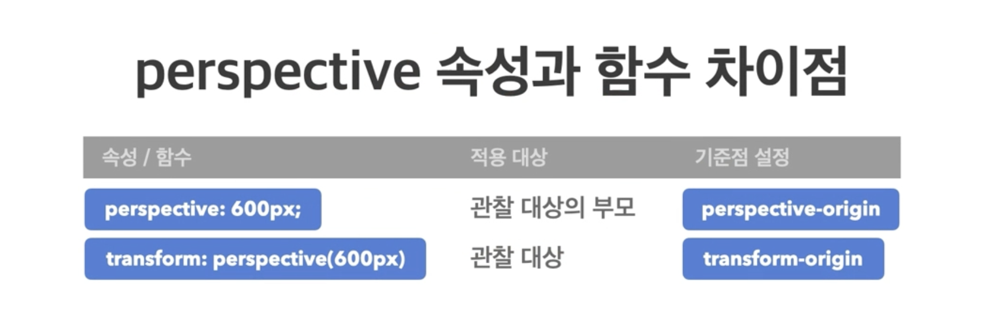

- 22.07.06
- fastcampus Megabyte School : 프론트엔드 개발 취업 연계 과정 강의에서 복습한 내용을 간단하게 정리 하였습니다.

# 1. transiton: 속성명 지속시간 타이밍함수 대기시간;

> 요소의 전환(시작과 끝) 효과를 지정하는 단축 속성

## ● transition-property

: 전환 효과를 사용할 속성 이름을 지정

- all: df, 모든 속성에 적용
- 속성이름: 전환 효과를 사용할 속성 이름 명시

## ● transition-duration

: 전환 효과의 지속시간을 지정

- 0s: 전환 효과 없음
- 시간: 지속시간(s)을 지정

## ● transition-timing-function

: 전환 효과의 타이밍(Easing)함수를 지정

- ease: df, 느리게-빠르게-느리게
- linear: 일정하게
- ease-in: 느리게-빠르게
- ease-out: 빠르게-느리게
- ease-in-out: 느리게-빠르게-느리게

## ● transition-delay

: 전환 효과가 몇 초 뒤에 시작할지 대기시간을 지정

- 0s: 대기시간 없음.
- 시간: 대기시간(s)을 지정

# 2. transform

> 요소의 변환 효과

- transform: 변환함수1 변환함수2 변환함수3...;
- transform: 원근법 이동 크기 회전 기울임;

## 2D변환 함수

### px단위

- translate(x, y): 이동
- scale(x, y): 크기, 하나만 명시해도 두군데 다 적용이 됨

### deg단위

- rotate(degree): 회전(각도)
- skewX(x), skewY(y): 기울임

## 3D변환 함수

### px단위

- perspective(n): 원근법(거리), 원근법 함수(원근 거리를 의미), 제일 앞에 작성해야 정상적으로 동작 함!!!

### deg단위

- rotateX(x), rotateY(y): 회전

ex)

```css
transform: perspective(500px) rotateX(45deg) rotateY(45deg);
```

🔥 3D변환 함수 사용 시 perspective(원근거리)를 적용해야 3D처럼 보임.

## 3D변환 속성

### 📎 perspective 속성

: 하위 요소를 관찰하는 원근거리를 지정
: 단위 px



👉🏻 perspective속성은 관찰 대상의 부모에 작성하고 perspective함수는 적용대상에 작성을 함

### backface-visibility

: 3D 변환으로 회전된 요소의 뒤면 숨김 여부

- visible: df, 뒷면 보임
- hidden: 뒷면 숨김
