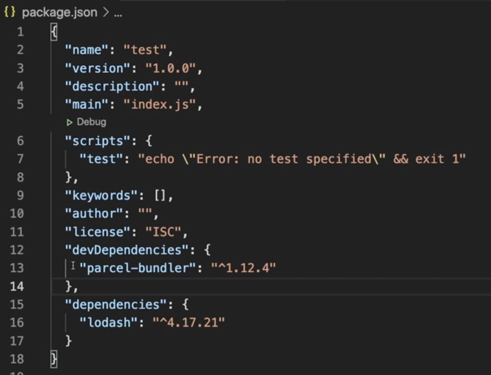
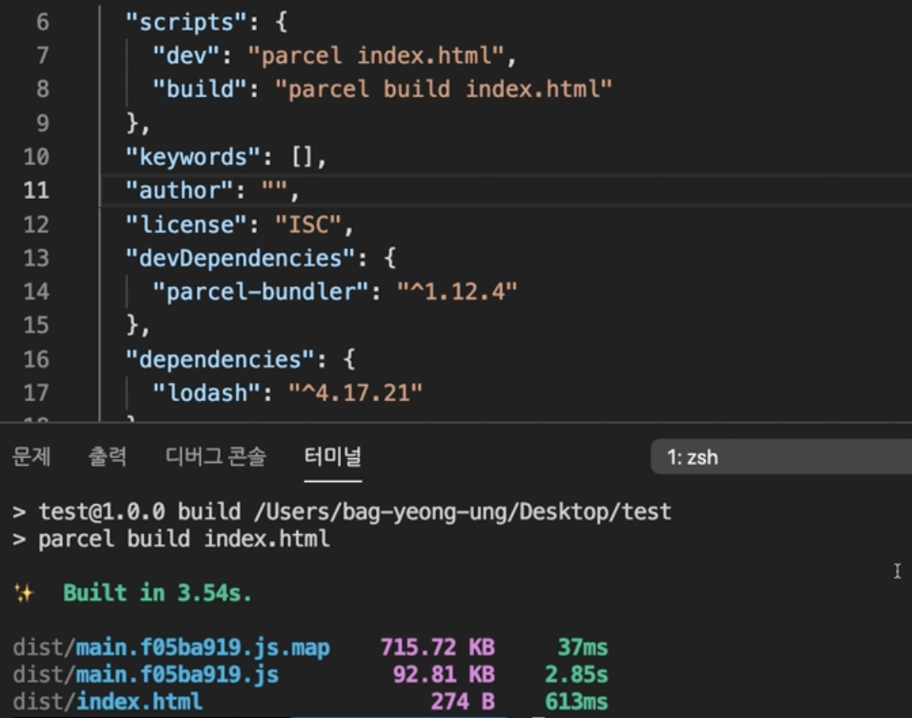

220712 - TIL

- fastcampus Megabyte School : 프론트엔드 개발 취업 연계 과정 강의에서 복습한 내용을 간단하게 정리 하였습니다.

# Node.js

- Node.js는 Chrome V8 JavaScript 엔진으로 빌드된 JavaScript 런타임(프로그래밍 언어가 동작하는 환경)환경이다.
- 브라우저의 자바스크립트 엔진을 브라우저에서 독립시킨 자바스크립트 실행 환경이다.
- 서버사이드 애플리케이션에서 주로 사용되며, 이에 필요한 모듈, 파일 시스템, HTTP등 빌트인(내장) API를 제공한다.
- JS가 동작할 수 있는 환경, sass, babel등의 모듈들을 **js로 변환작업을 명령하는 환경**을 제공 한다.
- 비동기 I/O를 지원하는 단일 스레드 이벤트 루프 기반으로 동작함으로써 요청 처리 성능이 좋다. 따라서 데이터를 실시간으로 처리하기 위해 I/O가 빈번하게 발생하는 SPA(Single Page Aplication)에 적합하다.

> 참고 01. 개요 및 설치 - Ch 1. Node.js

# nvm : node version manager

## ● nvm 명령어

- `nvm ls` : 설치된 node 버전의 list출력
- `nvm install [node.js버전]` : node.js설치
- `nvm use [node.js버전]` : 사용할 node.js의 버전 선택
- `nvm uninstall [node.js버전]`: 사용하지 않는 버전 삭제
- `nvm --help` : nvm과 관련된 명령어 확인

> 참고 02. NVM 사용법 - Ch 1. Node.js

# NPM(Node Package Manager)

> 전 세계의 개발자들이 만든 다양한 기능(패키지, 모듈)들을 관리.

## ● npm 명령어

- `npm init -y` : package.json 파일 추가 됨.
- `npm install parcel-bundler -D `: 해당 패키지 설치
- `npm i` : 설치한 패키지 파일을 삭제했을 경우 해당 명령어 실행 시 package.json에 있는 내역대로 패키지가 설치 됨!!
- `package-lock.json` : 내부적으로 사용되는 패키지들의 정보가 자동으로 관리 되는 파일

## ● npm i 패키지 -D

- package.json파일에서 devDependencies, dependencies 옵션의 차이

  - dependencies : 일반 의존성으로 설치한 패키지들의 내역
  - devDependencies : -D 플래그를 추가하여 설치한 패키지들의 내역

- `-D 플래그`: (= --save-dev) 개발용 의존성 패키지 설치, 설치한 패키지들이 개발시에만 사용하고 추후 웹 브라우저에서는 사용하지 않는 패키지 설치를 의미함.

🔥 node_modules폴더는 삭제해도 npm i로 복구가 가능하지만 package.json, package-lock.json 파일은 프로젝트 관리하면서 삭제 되지 않게 조심해야 함!!

## ● npm run

- package.json파일에서 "scripts"옵션
  : 터미널에서 해당 옵션에 추가한 key를 사용할 수있음.
- scripts부분을 run명령어로 통해 실행 시킴!

[ex]

1. "dev" : "parcel index.html"

- parcel-bundler패키지는 parcel 명령어로 index.html기준으로 로컬환경에서 개발용으로 서버를 열 수 있게 해줌.
- 패키지는 project안에서만 설치했기 때문에 터미널에서 집적적으로 명령어를 실행할 수 없어 해당 옵션에 추가하여 npm run으로 실행 함!!

2. "build" : "parcel build index.html"

- 실제로 사용자가 보는 용도로 결과물이 출력됨
- dist폴더 생성: 빌드된 결과 파일들, 해당 파일들은 브라우저에서 해석되는 용도로 코드 난독화가 되어있음. 용량을 축소하고 읽기 어렵게 만드는 등의 최적화를 거친 파일들이 존재함. 또한 실제 브라우저에서 사용되는 패키지들까지 묶어(번들) 파일을 생성함.

💡 `코드 난독화`란 작성된코드를 읽기 어렵게 만드는 작업을 말함.

💡 `번들(bundel)`은 프로젝트 개발에 사용한 여러 모듈(패키지)을 하나로 묶어내는 작업을 말함.

> 참고 05. 개발 서버 실행과 빌드 - Ch 1. Node.js
